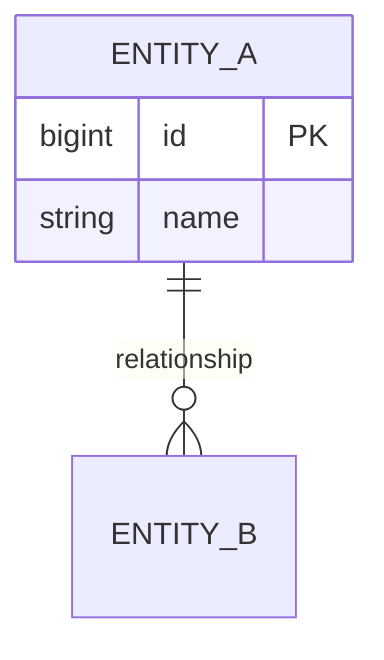

# E-R Design Template

## Entity Description
| Entity | Chinese Name | Primary Key | Main Attributes | Reason |
|---|---|---|---|---|

## Relationship Description
| Relationship | Entity A | Cardinality | Entity B | Business Meaning |
|---|---|---|---|---|

## Mermaid ER Template

## Conceptual Design Checks
- Does every appointment have a visitor and host?
- Can approval history be represented independently?
- Can entry and exit records be represented?
- Can blacklist and pass-code behavior be explained?
- Can roles and permissions support access control?
