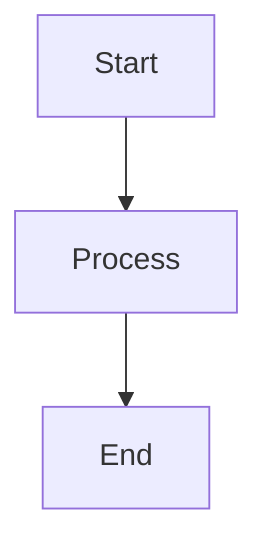
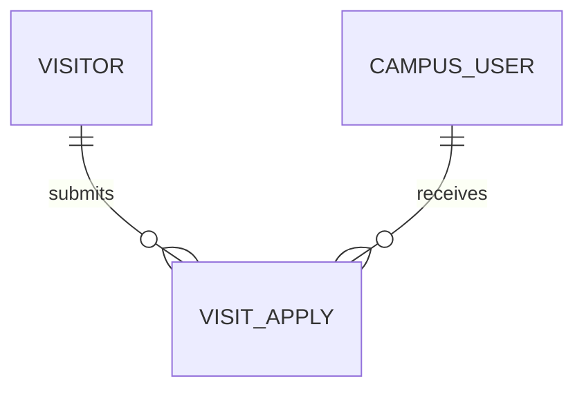
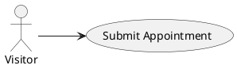

# Diagram Template

## Mermaid Flowchart

```mermaid
flowchart TD
  A[Start] --> B[Process]
  B --> C[End]
```

## Mermaid E-R Diagram

```mermaid
erDiagram
  VISITOR ||--o{ VISIT_APPLY : submits
  CAMPUS_USER ||--o{ VISIT_APPLY : receives
```

## PlantUML Use Case

```plantuml
@startuml
left to right direction
actor Visitor
usecase "Submit Appointment" as UC1
Visitor --> UC1
@enduml
```

## Explanation Pattern
This diagram shows ..., including ..., and supports the report section on ....
