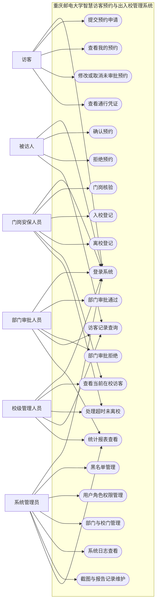
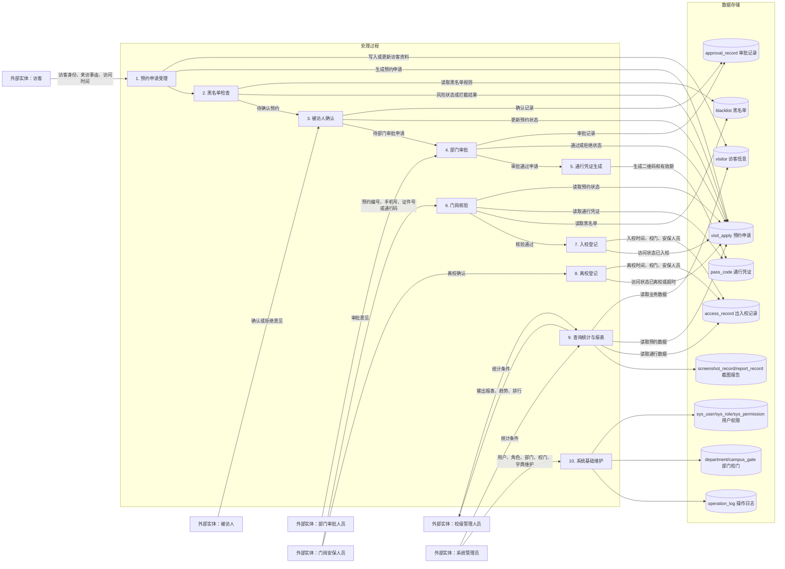
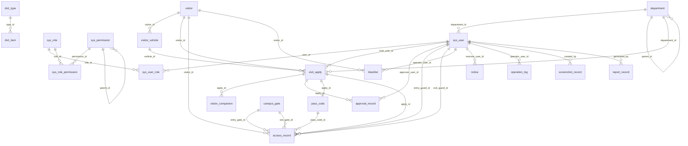
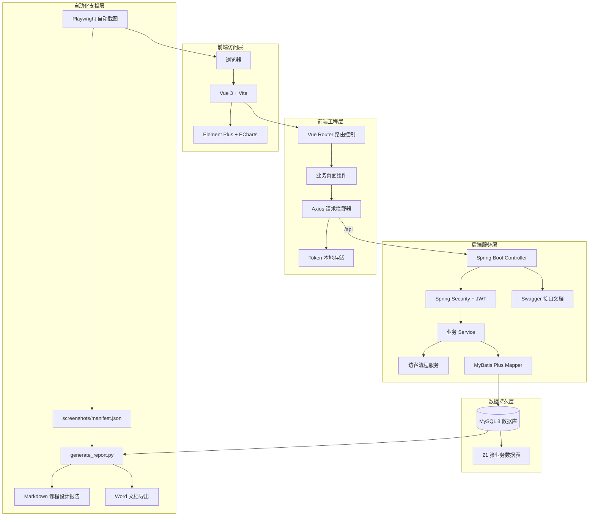
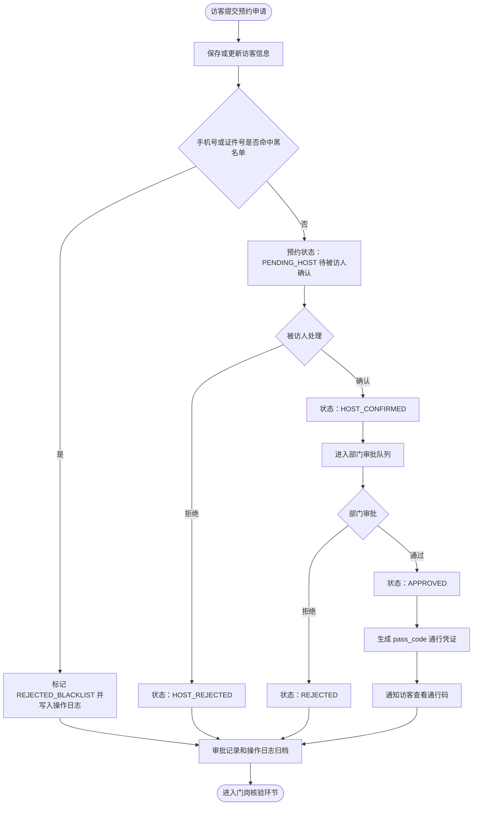
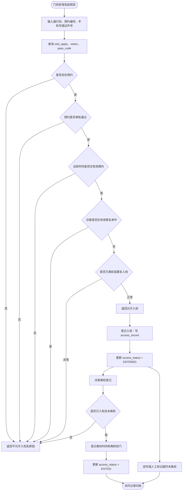
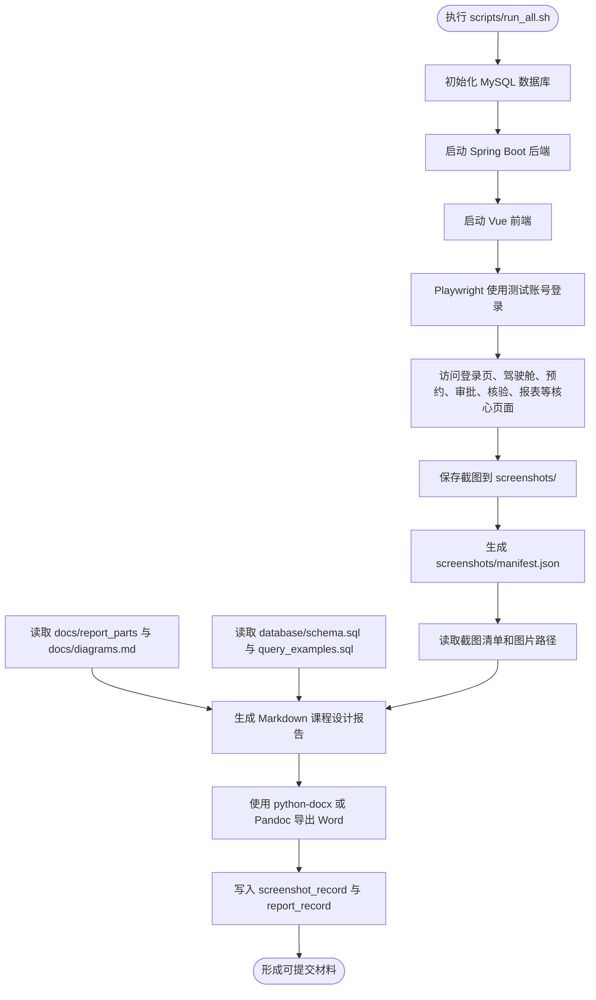

# 系统设计图汇总

本文档汇总“重庆邮电大学智慧访客预约与出入校管理系统”课程设计报告所需的主要 Mermaid 图。图中的模块、实体、表名、角色和状态与当前项目代码、数据库脚本及需求文档保持一致。

## 1. 系统功能模块图

对应文件：`diagrams/system_module.mmd`

```mermaid
flowchart TB
  SYS[重庆邮电大学智慧访客预约与出入校管理系统]

  SYS --> M1[首页统计驾驶舱]
  SYS --> M2[访客预约管理]
  SYS --> M3[确认与审批管理]
  SYS --> M4[通行凭证与门岗核验]
  SYS --> M5[出入校登记管理]
  SYS --> M6[安全风控管理]
  SYS --> M7[查询统计报表]
  SYS --> M8[系统基础管理]
  SYS --> M9[自动截图与报告管理]

  M1 --> M101[今日访客概览]
  M1 --> M102[当前在校与超时预警]
  M1 --> M103[趋势图与排行图]
  M1 --> M104[快捷入口]

  M2 --> M201[访客预约申请]
  M2 --> M202[我的预约]
  M2 --> M203[预约详情]
  M2 --> M204[修改未审批预约]
  M2 --> M205[取消未审批预约]

  M3 --> M301[被访人待确认]
  M3 --> M302[被访人确认或拒绝]
  M3 --> M303[部门待审批]
  M3 --> M304[部门审批通过或拒绝]
  M3 --> M305[审批记录留痕]

  M4 --> M401[通行码生成]
  M4 --> M402[通行码查询]
  M4 --> M403[预约编号核验]
  M4 --> M404[手机号或证件号核验]
  M4 --> M405[核验结果提示]

  M5 --> M501[入校登记]
  M5 --> M502[离校登记]
  M5 --> M503[当前在校访客]
  M5 --> M504[超时未离校访客]
  M5 --> M505[访问记录归档]

  M6 --> M601[黑名单管理]
  M6 --> M602[黑名单自动检查]
  M6 --> M603[异常通行处理]
  M6 --> M604[系统操作日志]

  M7 --> M701[访客记录查询]
  M7 --> M702[部门访客排行]
  M7 --> M703[校门通行统计]
  M7 --> M704[近七天访问趋势]
  M7 --> M705[审批通过率]

  M8 --> M801[用户管理]
  M8 --> M802[角色权限管理]
  M8 --> M803[部门管理]
  M8 --> M804[校门管理]
  M8 --> M805[字典管理]

  M9 --> M901[Playwright 自动截图]
  M9 --> M902[截图清单 manifest]
  M9 --> M903[Markdown 报告生成]
  M9 --> M904[Word 报告导出]
```

该图从课程设计报告的系统功能角度描述重庆邮电大学智慧访客预约与出入校管理系统的功能边界。系统围绕访客预约、确认审批、通行核验、出入校登记、安全风控、统计报表和系统基础管理展开，并补充自动截图与报告管理模块，能够覆盖数据库课程设计要求中的主要业务模块。

## 2. 用户用例图

对应文件：`diagrams/use_case.mmd`

该图描述访客、被访人、部门审批人员、门岗安保人员、系统管理员和校级管理人员六类角色与系统功能之间的使用关系。用例覆盖预约提交、审批处理、门岗核验、出入校登记、统计查询和系统维护，体现了系统的角色权限边界。

## 3. 数据流程图

对应文件：`diagrams/data_flow.mmd`

该图综合表示顶层数据流程和二层数据处理过程。访客预约数据先进入预约申请受理和黑名单检查，再经过被访人确认、部门审批、通行凭证生成、门岗核验、入校登记、离校登记和查询统计等处理过程，所有关键数据均落入对应数据库表。

## 4. E-R 图

对应文件：`diagrams/er_diagram.mmd`

```mermaid
erDiagram
  DEPARTMENT ||--o{ SYS_USER : contains
  DEPARTMENT ||--o{ VISIT_APPLY : receives
  DEPARTMENT ||--o{ DEPARTMENT : parent_of

  SYS_USER ||--o{ SYS_USER_ROLE : owns
  SYS_ROLE ||--o{ SYS_USER_ROLE : assigned
  SYS_ROLE ||--o{ SYS_ROLE_PERMISSION : owns
  SYS_PERMISSION ||--o{ SYS_ROLE_PERMISSION : granted
  SYS_PERMISSION ||--o{ SYS_PERMISSION : parent_of

  VISITOR ||--o{ VISITOR_VEHICLE : owns
  VISITOR ||--o{ VISIT_APPLY : submits
  VISITOR ||--o{ BLACKLIST : may_be_listed
  VISITOR ||--o{ ACCESS_RECORD : enters_or_exits

  SYS_USER ||--o{ VISIT_APPLY : hosts
  VISIT_APPLY ||--o{ VISITOR_COMPANION : includes
  VISITOR_VEHICLE ||--o{ VISIT_APPLY : used_by
  VISIT_APPLY ||--o{ APPROVAL_RECORD : has
  SYS_USER ||--o{ APPROVAL_RECORD : approves
  VISIT_APPLY ||--|| PASS_CODE : generates
  PASS_CODE ||--o{ ACCESS_RECORD : verifies
  VISIT_APPLY ||--o{ ACCESS_RECORD : produces
  CAMPUS_GATE ||--o{ ACCESS_RECORD : records
  SYS_USER ||--o{ ACCESS_RECORD : handles

  SYS_USER ||--o{ NOTICE : receives
  SYS_USER ||--o{ OPERATION_LOG : creates
  DICT_TYPE ||--o{ DICT_ITEM : contains
  SYS_USER ||--o{ SCREENSHOT_RECORD : creates
  SYS_USER ||--o{ REPORT_RECORD : generates

  DEPARTMENT {
    bigint id PK
    bigint parent_id FK
    varchar dept_code UK
    varchar dept_name
    bigint leader_user_id FK
  }

  SYS_USER {
    bigint id PK
    varchar username UK
    varchar password_hash
    varchar real_name
    bigint department_id FK
    varchar user_type
  }

  SYS_ROLE {
    bigint id PK
    varchar role_code UK
    varchar role_name
  }

  SYS_PERMISSION {
    bigint id PK
    varchar permission_code UK
    varchar permission_name
    varchar route_path
    varchar api_path
  }

  VISITOR {
    bigint id PK
    varchar visitor_name
    varchar id_number UK
    varchar phone
    varchar visitor_level
  }

  VISIT_APPLY {
    bigint id PK
    varchar apply_no UK
    bigint visitor_id FK
    bigint host_user_id FK
    bigint department_id FK
    bigint vehicle_id FK
    varchar apply_status
    varchar access_status
  }

  APPROVAL_RECORD {
    bigint id PK
    bigint apply_id FK
    varchar approval_step
    bigint approver_user_id FK
    varchar approval_result
    datetime approval_time
  }

  PASS_CODE {
    bigint id PK
    bigint apply_id FK
    varchar pass_code UK
    datetime valid_from
    datetime valid_to
    varchar pass_status
  }

  ACCESS_RECORD {
    bigint id PK
    bigint apply_id FK
    bigint visitor_id FK
    bigint pass_code_id FK
    bigint entry_gate_id FK
    bigint exit_gate_id FK
    varchar access_status
  }
```

该图从概念结构角度描述系统核心实体及联系，包括部门、系统用户、角色权限、访客、预约申请、审批记录、通行凭证、出入校记录、黑名单、通知、日志、截图记录和报告记录。实体关系能够自然转换为后续 MySQL 关系模式。

## 5. 数据库表关系图

对应文件：`diagrams/table_relation.mmd`

该图从逻辑结构角度展示 MySQL 表之间的主外键依赖关系。图中表名与 schema.sql 保持一致，说明 visit_apply、approval_record、pass_code、access_record 等核心业务表如何连接访客、用户、部门和校门基础数据。

## 6. 系统架构图

对应文件：`diagrams/system_architecture.mmd`

该图描述系统技术架构。前端采用 Vue 3、Vite、Element Plus、Axios 和 ECharts，后端采用 Spring Boot 3、Spring Security、JWT、MyBatis Plus，数据库采用 MySQL 8，同时由 Playwright 和报告生成脚本支撑自动截图与课程设计报告生成。

## 7. 访客预约审批流程图

对应文件：`diagrams/visitor_workflow.mmd`

该图描述从访客提交预约到审批通过生成通行凭证的完整流程。流程包含黑名单自动检查、被访人确认、部门审批、审批记录留痕和通行码生成，体现了预约状态从 PENDING_HOST 到 APPROVED、REJECTED 等状态的流转。

## 8. 门岗核验入校流程图

对应文件：`diagrams/gate_check_workflow.mmd`

该图描述门岗安保人员使用预约编号、手机号、证件号或通行码核验访客的过程。系统会检查预约是否存在、审批是否通过、访问时间是否有效、是否命中黑名单以及是否重复入离校，并据此完成入校、离校或超时处理。

## 9. 自动截图和报告生成流程图

对应文件：`diagrams/automation_report_workflow.mmd`

该图描述后续自动化交付流程。系统通过 run_all.sh 串联数据库初始化、后端启动、前端启动、Playwright 自动登录截图、manifest 生成、Markdown 报告生成和 Word 导出，为课程设计报告提供可重复生成的截图与文档材料。

