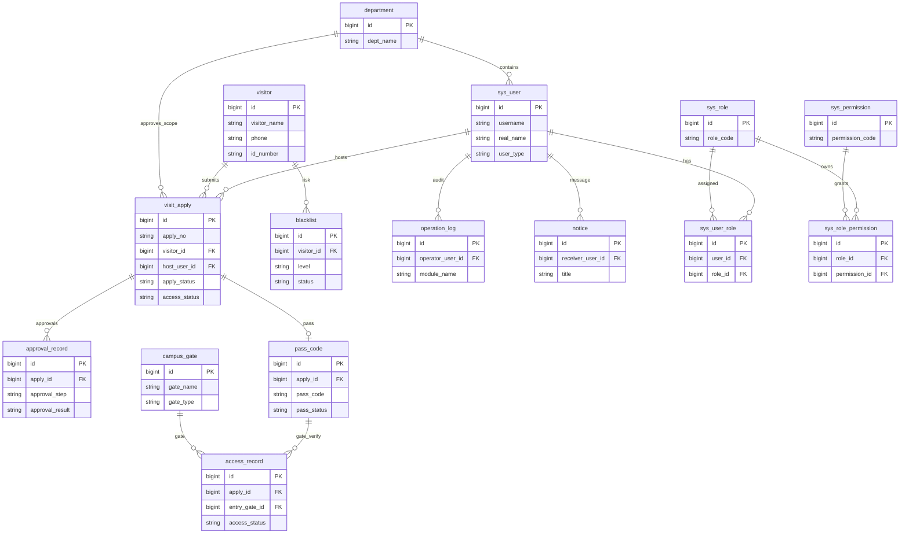
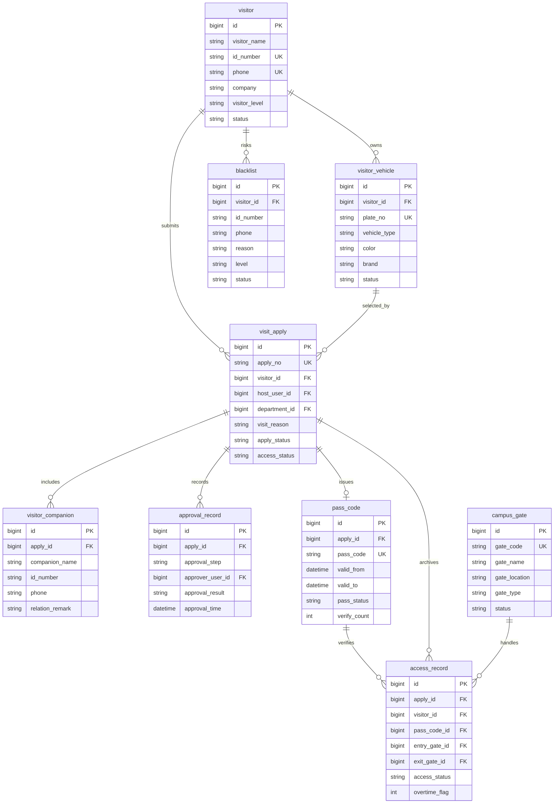
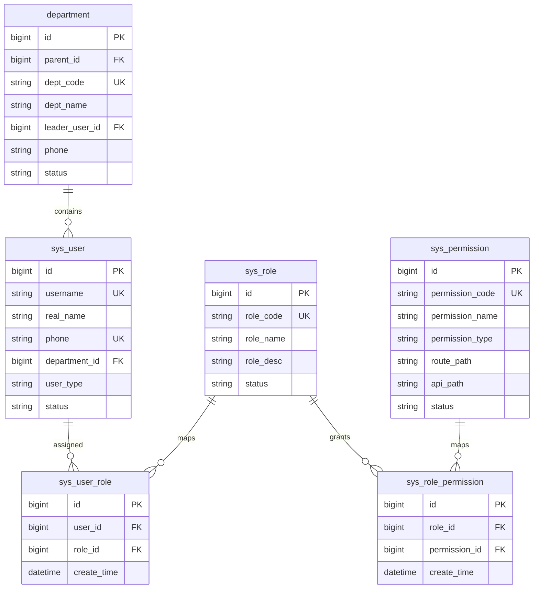
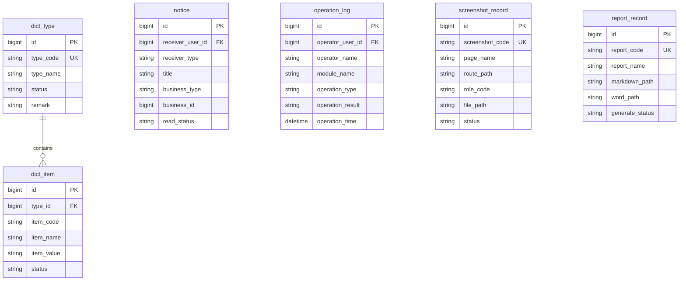
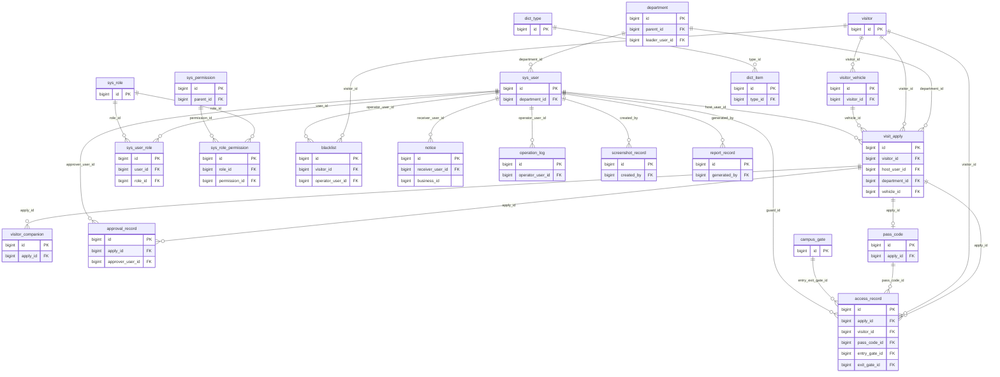
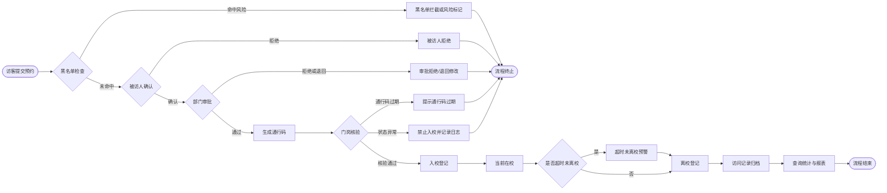
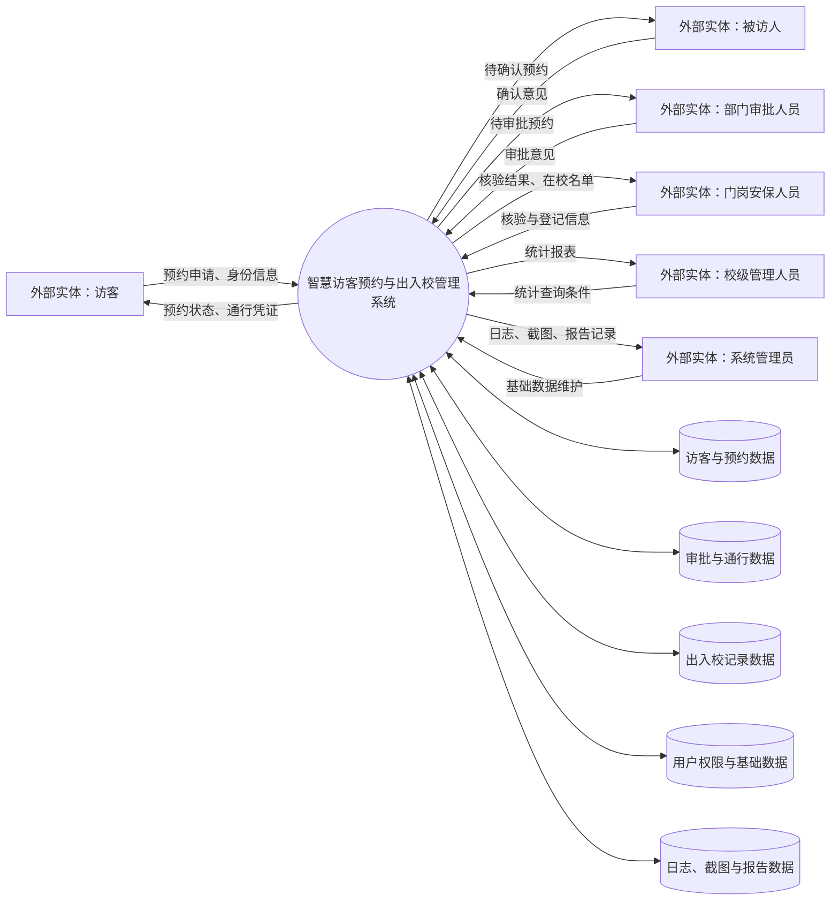
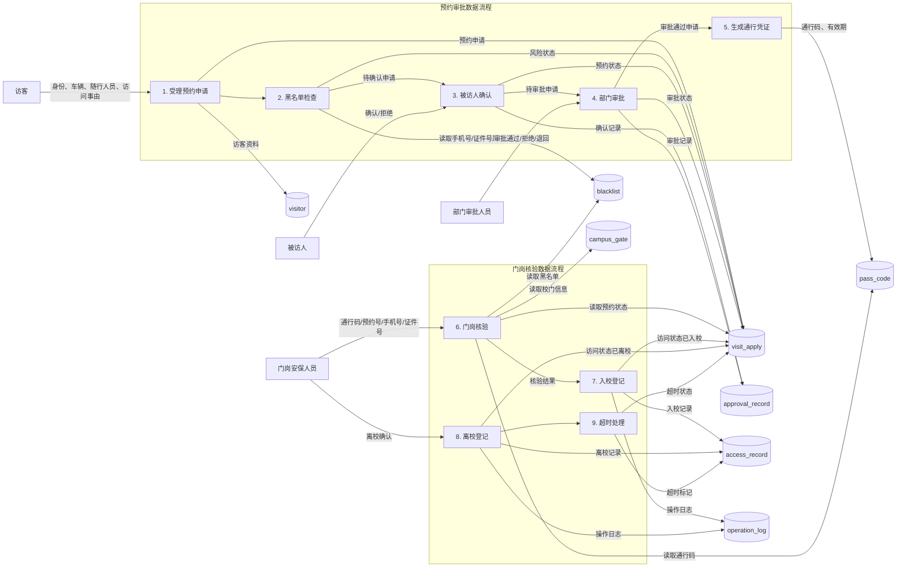
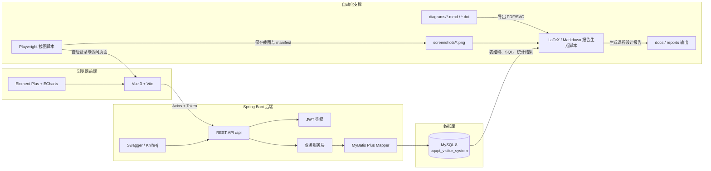

# 系统设计图汇总

本文档汇总“重庆邮电大学智慧访客预约与出入校管理系统”课程设计报告所需图件。为避免图形过大和线条交叉，E-R 图按业务域拆分，流程图按功能层次拆分，完整主外键表关系图建议作为附录使用。

## 报告使用建议

| 推荐位置 | 图文件 | 用途 |
| --- | --- | --- |
| 正文 | `diagrams/er_overview.mmd` | 概念结构总体说明 |
| 正文 | `diagrams/er_core_business.mmd` | 说明访客预约、审批、通行、出入校核心流程 |
| 正文 | `diagrams/system_module.mmd` | 说明系统功能模块划分 |
| 正文 | `diagrams/visitor_workflow.mmd` | 说明预约审批业务流程 |
| 正文 | `diagrams/data_flow_level0.mmd`、`diagrams/data_flow_level1.mmd` | 说明数据流程图 |
| 附录 | `diagrams/er_user_permission.mmd`、`diagrams/er_system_support.mmd`、`diagrams/table_relation.mmd` | 展示权限、支撑实体和完整表关系 |

## 1. 总体简化 E-R 图

对应文件：`diagrams/er_overview.mmd`

总体简化 E-R 图只保留主要实体和主干关系，用于报告正文快速说明概念模型全貌。图中不展开所有弱关联和审计字段，重点突出访客、预约、审批、通行、权限和系统支撑之间的主联系。



## 2. 核心业务 E-R 图

对应文件：`diagrams/er_core_business.mmd`

核心业务 E-R 图围绕访客预约主流程设计，展示访客、车辆、随行人员、预约申请、审批记录、通行凭证、出入校记录、校门和黑名单之间的关系。该图建议放在概念结构设计正文。



## 3. 用户权限 E-R 图

对应文件：`diagrams/er_user_permission.mmd`

用户权限 E-R 图单独展示组织部门、系统用户、角色、权限以及两张关联表，避免 RBAC 多对多关系干扰核心访客业务图。



## 4. 系统支撑 E-R 图

对应文件：`diagrams/er_system_support.mmd`

系统支撑 E-R 图展示通知、日志、字典、截图记录和报告记录。由于这些实体主要服务于消息提醒、审计、自动截图和报告生成，未放入核心业务 E-R 图。



## 5. 数据库表关系图

对应文件：`diagrams/table_relation.mmd`

数据库表关系图面向逻辑结构与主外键说明，覆盖主要外键关系。该图比概念 E-R 图更接近 MySQL 表结构，建议作为报告附录或“其它设计图”。



## 6. 系统功能模块图

对应文件：`diagrams/system_module.mmd`

系统功能模块图采用层次结构，一级模块包括访客端、被访人端、审批管理、门岗管理、访客记录、安全管理、统计报表、系统管理和自动化支撑。

```mermaid
flowchart TB
  SYS[重庆邮电大学智慧访客预约与出入校管理系统]

  SYS --> V[访客端]
  SYS --> H[被访人端]
  SYS --> A[审批管理]
  SYS --> G[门岗管理]
  SYS --> R[访客记录]
  SYS --> S[安全管理]
  SYS --> T[统计报表]
  SYS --> M[系统管理]
  SYS --> X[自动化支撑]

  subgraph VisitorSide[访客端]
    V1[访客预约]
    V2[状态查询]
    V3[通行凭证]
    V4[历史记录]
  end

  subgraph HostSide[被访人端]
    H1[待确认预约]
    H2[确认预约]
    H3[拒绝预约]
    H4[接待记录]
  end

  subgraph ApprovalSide[审批管理]
    A1[部门待审批]
    A2[审批通过]
    A3[审批拒绝]
    A4[审批记录留痕]
  end

  subgraph GateSide[门岗管理]
    G1[通行码核验]
    G2[入校登记]
    G3[离校登记]
    G4[当前在校访客]
    G5[超时未离校]
  end

  subgraph RecordSide[访客记录]
    R1[预约记录查询]
    R2[出入校记录]
    R3[审批轨迹]
    R4[车辆与随行人员]
  end

  subgraph SecuritySide[安全管理]
    S1[黑名单管理]
    S2[黑名单自动检查]
    S3[异常通行处理]
    S4[操作日志审计]
  end

  subgraph ReportSide[统计报表]
    T1[今日/本周/本月访客]
    T2[近七天趋势]
    T3[部门访客排行]
    T4[校门通行统计]
    T5[审批与风险分布]
  end

  subgraph ManageSide[系统管理]
    M1[用户管理]
    M2[角色权限管理]
    M3[部门管理]
    M4[校门管理]
    M5[字典管理]
  end

  subgraph AutomationSide[自动化支撑]
    X1[自动截图]
    X2[截图清单]
    X3[自动报告生成]
    X4[报告生成记录]
  end

  V --> V1
  V --> V2
  V --> V3
  V --> V4
  H --> H1
  H --> H2
  H --> H3
  H --> H4
  A --> A1
  A --> A2
  A --> A3
  A --> A4
  G --> G1
  G --> G2
  G --> G3
  G --> G4
  G --> G5
  R --> R1
  R --> R2
  R --> R3
  R --> R4
  S --> S1
  S --> S2
  S --> S3
  S --> S4
  T --> T1
  T --> T2
  T --> T3
  T --> T4
  T --> T5
  M --> M1
  M --> M2
  M --> M3
  M --> M4
  M --> M5
  X --> X1
  X --> X2
  X --> X3
  X --> X4
```



## 7. 访客预约审批流程图

对应文件：`diagrams/visitor_workflow.mmd`

访客预约审批流程图展示从访客申请到黑名单检查、被访人确认、部门审批、通行码生成、门岗核验、入校、离校和归档的完整流程，并标出拒绝、过期、超时等异常分支。



## 8. 门岗核验入校流程图

对应文件：`diagrams/gate_check_workflow.mmd`

门岗核验流程图以安保人员操作为主线，展示通行码、预约状态、访问时间、黑名单和通行码有效性的逐项校验逻辑。


## 9. 顶层数据流程图

对应文件：`diagrams/data_flow_level0.mmd`

顶层数据流程图按照数据库课程设计要求展示外部实体、系统处理过程、数据存储和主要数据流。



## 10. 二层数据流程图

对应文件：`diagrams/data_flow_level1.mmd`

二层数据流程图将预约审批和门岗核验两个核心数据流程展开，明确各处理过程读写的数据存储。



## 11. 系统架构图

对应文件：`diagrams/system_architecture.mmd`

系统架构图展示 Vue 前端、Spring Boot 后端、MySQL 数据库、Playwright 自动截图、图文件目录、截图目录和报告输出目录之间的协作关系。



## DOT 与 PDF 导出命令

如果本地已安装 Graphviz，可执行以下命令生成 LaTeX 可直接引用的 PDF 图：

```bash
dot -Tpdf diagrams/er_core_business.dot -o diagrams/export/er_core_business.pdf
dot -Tpdf diagrams/er_user_permission.dot -o diagrams/export/er_user_permission.pdf
dot -Tpdf diagrams/er_system_support.dot -o diagrams/export/er_system_support.pdf
dot -Tpdf diagrams/er_overview.dot -o diagrams/export/er_overview.pdf
dot -Tpdf diagrams/table_relation.dot -o diagrams/export/table_relation.pdf
```

如果使用 Mermaid CLI，可执行：

```bash
mmdc -i diagrams/er_core_business.mmd -o diagrams/export/er_core_business.pdf
mmdc -i diagrams/er_user_permission.mmd -o diagrams/export/er_user_permission.pdf
mmdc -i diagrams/er_system_support.mmd -o diagrams/export/er_system_support.pdf
mmdc -i diagrams/er_overview.mmd -o diagrams/export/er_overview.pdf
mmdc -i diagrams/table_relation.mmd -o diagrams/export/table_relation.pdf
```
