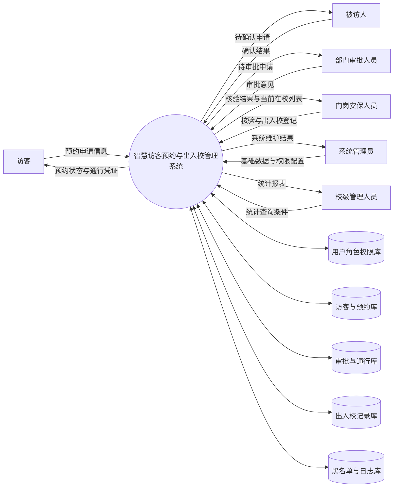
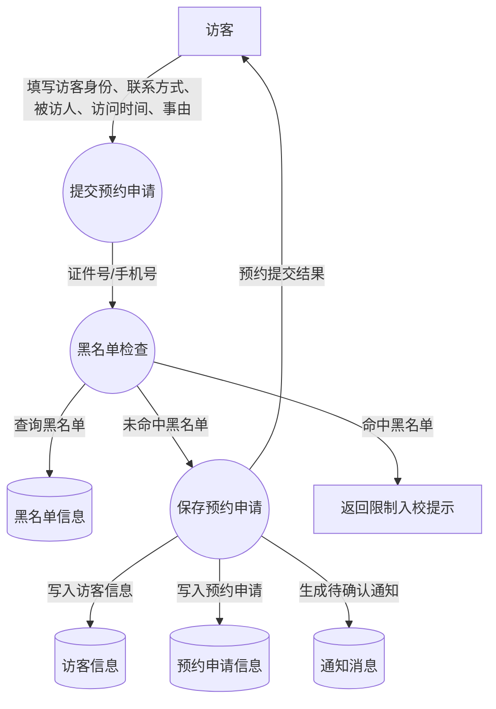
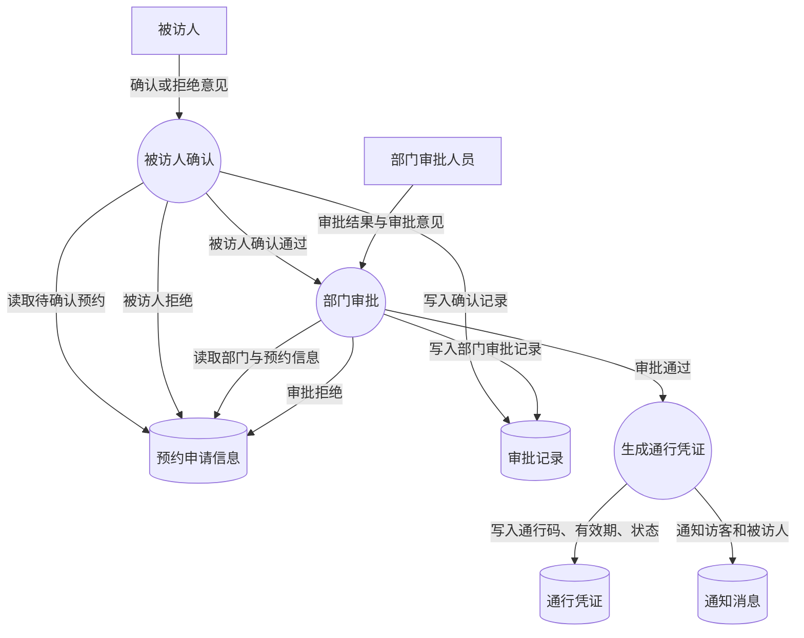
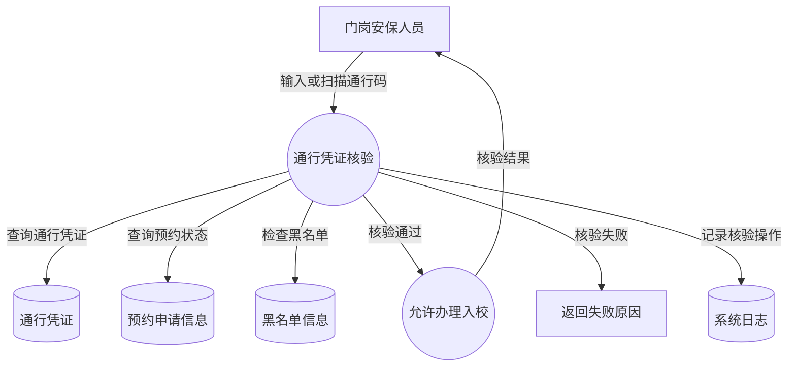
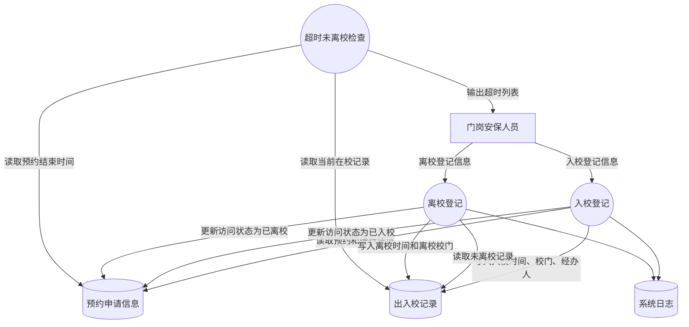

# 03 数据流程图

本节使用 Mermaid 描述“重庆邮电大学智慧访客预约与出入校管理系统”的主要数据流程。数据流程图中的外部实体、处理过程、数据流和数据存储均在数据字典中给出解释。

## 1. 顶层数据流程图

说明：顶层数据流程图展示系统与六类外部角色之间的数据交换，以及系统内部主要数据存储。

## 2. 访客预约数据流程图

说明：预约数据流程以访客提交信息为起点，系统先检查黑名单，再保存访客和预约数据，并通知被访人确认。

## 3. 审批数据流程图

说明：审批流程分为被访人确认和部门审批两个环节，所有审批动作均写入审批记录，审批通过后才生成通行凭证。

## 4. 门岗核验数据流程图

说明：门岗核验必须同时检查通行凭证、预约状态和黑名单信息，核验失败时返回明确原因并记录操作日志。

## 5. 出入校登记数据流程图

说明：出入校登记以 `access_record` 为核心数据存储，入校和离校操作都需要防止重复登记，并为当前在校和超时未离校查询提供依据。
