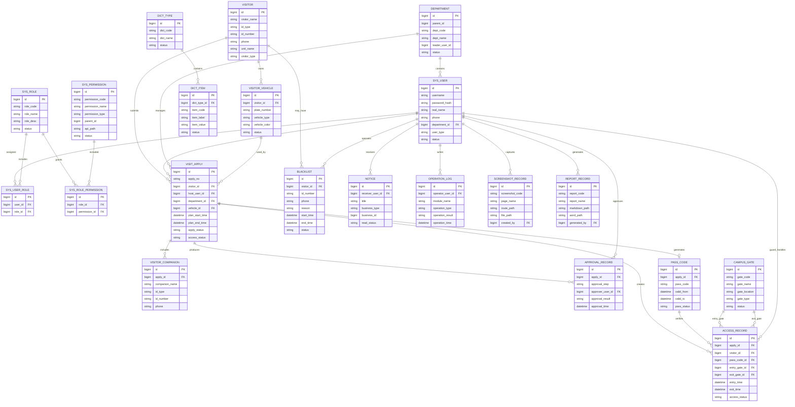

# 06 E-R 图

## 1. E-R 图设计说明

根据概念结构设计，本系统以 `visit_apply` 访客预约为核心业务实体，向前关联 `visitor` 访客、`sys_user` 被访人、`department` 部门，向后关联 `approval_record` 审批记录、`pass_code` 通行凭证和 `access_record` 出入校记录。同时，系统通过 `sys_user`、`sys_role`、`sys_permission` 支撑角色权限控制，通过 `blacklist`、`operation_log` 支撑安全管理与审计，通过 `dict_type`、`dict_item` 支撑状态和类型配置，通过 `screenshot_record`、`report_record` 支撑自动截图与报告生成。

E-R 图中的多对多联系包括“用户拥有角色”和“角色拥有权限”，后续逻辑结构设计将分别转换为 `sys_user_role` 和 `sys_role_permission` 两个关系表。

## 2. Mermaid E-R 图

## 3. 图形说明

该 E-R 图突出三个层次：

1. **权限与组织层**：`department`、`sys_user`、`sys_role`、`sys_permission` 共同支撑系统登录、角色分配和接口权限控制。
2. **访客业务层**：`visitor`、`visit_apply`、`approval_record`、`pass_code`、`access_record` 构成从预约到离校的主流程。
3. **系统支撑层**：`blacklist`、`notice`、`operation_log`、`dict_type`、`dict_item`、`screenshot_record`、`report_record` 支撑安全控制、消息提醒、审计、基础配置和课程设计自动化材料管理。

图中实体和联系能够自然转换为 MySQL 关系表，后续逻辑结构设计将进一步明确字段类型、主键、外键、唯一约束、索引和范式检查。
