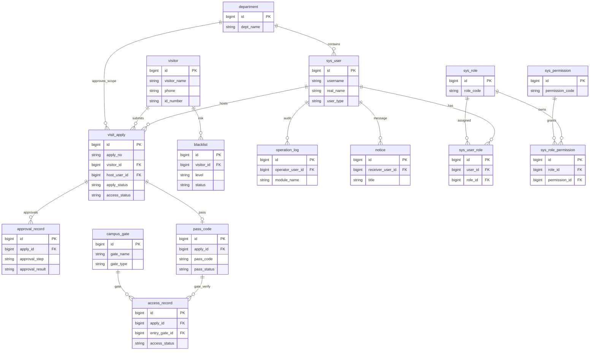
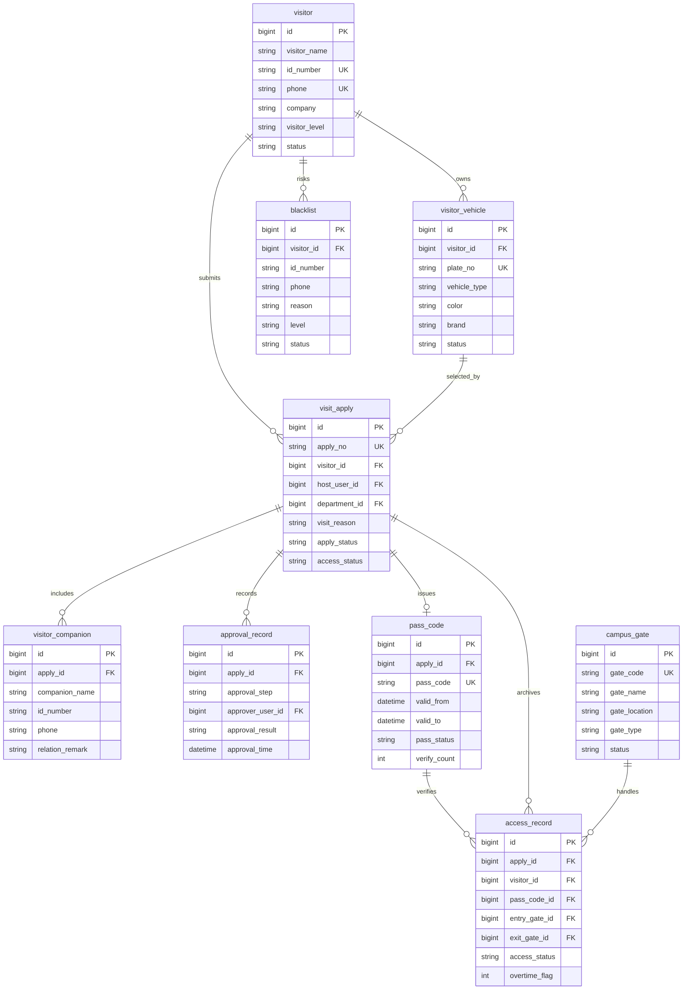
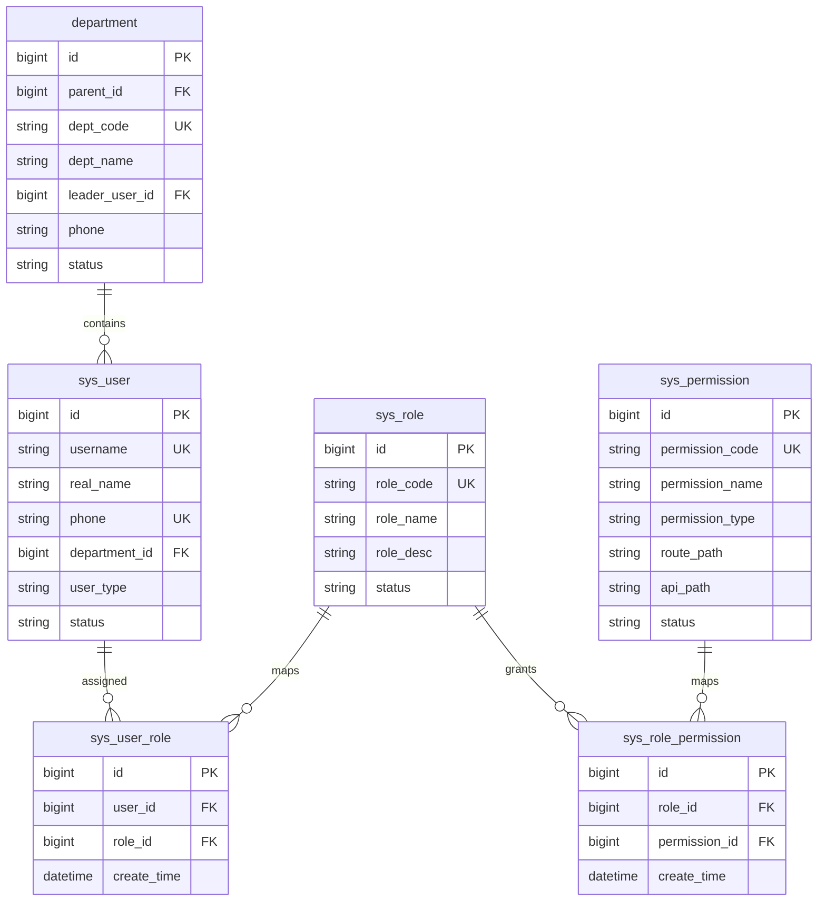
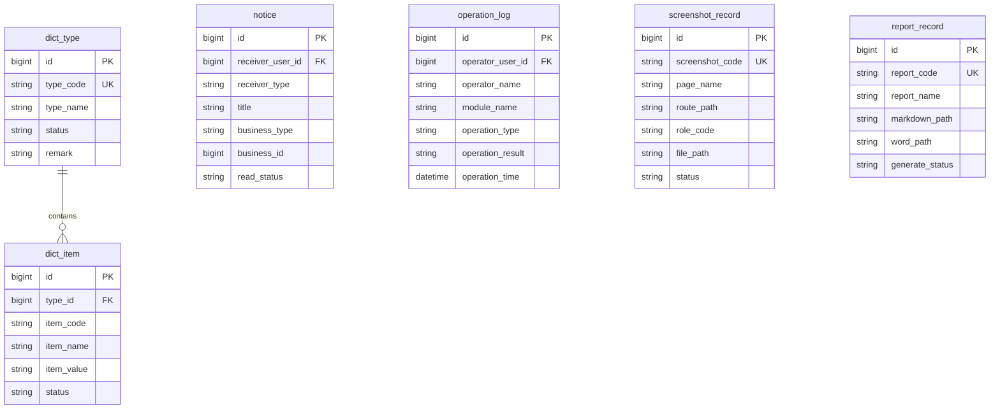
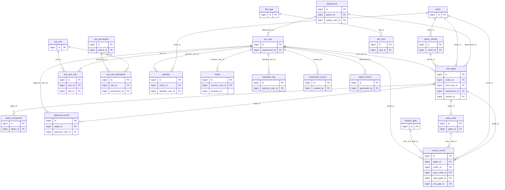

# 06 E-R 图

## 1. 拆分 E-R 图的原因

“重庆邮电大学智慧访客预约与出入校管理系统”包含访客预约、审批流转、门岗核验、RBAC 权限、通知日志、数据字典、自动截图和自动报告等多类实体。若将所有实体、字段和联系全部放入一张 E-R 图，会出现图幅过大、线条交叉严重、读者难以抓住主流程的问题。因此，本报告采用“总体简化图 + 分域详图 + 表关系图”的表达方式。

拆分后的图形遵循以下原则：

1. 每张 Mermaid E-R 图使用 `erDiagram`，实体字段不超过 8 个，仅保留关键字段。
2. 核心业务图只展示访客预约主流程，不强行放入截图、报告、字典等支撑实体。
3. 用户权限图单独展示 `sys_user`、`sys_role`、`sys_permission` 及两张关联表，避免 RBAC 多对多关系干扰业务主线。
4. 系统支撑图单独展示消息、日志、字典、截图记录和报告记录，体现系统运行与课程设计自动化支撑能力。
5. 完整主外键关系放入 `table_relation.mmd`，适合在附录或“其它设计图”中展示。

## 2. 图文件清单与业务范围

| 图文件 | 业务范围 | 推荐位置 |
| --- | --- | --- |
| `diagrams/er_overview.mmd` | 系统主要实体与主干关系 | 报告正文 |
| `diagrams/er_core_business.mmd` | 访客、预约、审批、通行码、出入校、校门、黑名单 | 报告正文重点图 |
| `diagrams/er_user_permission.mmd` | 部门、用户、角色、权限、用户角色、角色权限 | 权限设计说明或附录 |
| `diagrams/er_system_support.mmd` | 通知、日志、字典、截图记录、报告记录 | 系统支撑说明或附录 |
| `diagrams/table_relation.mmd` | 数据库主外键关系 | 逻辑设计附录 |

## 3. 总体简化 E-R 图

该图用于说明系统概念模型全貌，只保留主要实体和主干关系。访客提交预约，预约经过审批产生通行凭证，门岗使用通行凭证形成出入校记录；部门、用户、角色和权限支撑组织与授权；通知和操作日志支撑系统运行。



## 4. 核心业务 E-R 图

该图表达访客预约主流程。`visitor` 是预约发起者，`visit_apply` 是核心业务单据，`approval_record` 记录被访人确认和部门审批轨迹，`pass_code` 表示审批通过后的通行凭证，`access_record` 记录门岗核验后的入校、离校或超时状态，`blacklist` 支撑预约和核验阶段的风险拦截。



## 5. 用户权限 E-R 图

该图表达系统 RBAC 权限模型。一个部门包含多个系统用户；用户与角色是多对多关系，逻辑设计中通过 `sys_user_role` 转换；角色与权限也是多对多关系，逻辑设计中通过 `sys_role_permission` 转换。该模型支撑访客、被访人、部门审批人员、门岗安保人员、系统管理员和校级管理人员的差异化菜单与接口权限。



## 6. 系统支撑 E-R 图

该图表达系统运行支撑实体。`notice` 用于预约、审批、超时和风险提醒；`operation_log` 用于关键操作审计；`dict_type` 与 `dict_item` 管理状态和类型字典；`screenshot_record` 和 `report_record` 支撑自动截图和课程设计报告生成。为保持图形清晰，支撑图中不重复绘制 `sys_user`，相关用户外键在表关系图中统一展示。



## 7. 数据库表关系图

表关系图更接近逻辑结构设计，用于展示主外键约束。该图包含核心业务、权限和系统支撑实体的主要外键，适合放入附录或“其它设计图”。



## 8. 核心关系到关系模式的转换

| 概念联系 | 联系类型 | 关系模式转换方式 |
| --- | --- | --- |
| 访客提交预约 | `visitor` 1:N `visit_apply` | 在 `visit_apply` 中设置 `visitor_id` 外键 |
| 访客拥有车辆 | `visitor` 1:N `visitor_vehicle` | 在 `visitor_vehicle` 中设置 `visitor_id` 外键 |
| 预约包含随行人员 | `visit_apply` 1:N `visitor_companion` | 在 `visitor_companion` 中设置 `apply_id` 外键 |
| 预约产生审批记录 | `visit_apply` 1:N `approval_record` | 在 `approval_record` 中设置 `apply_id` 外键 |
| 审批通过生成通行凭证 | `visit_apply` 1:0..1 `pass_code` | 在 `pass_code` 中设置唯一 `apply_id` 外键 |
| 通行凭证用于出入校 | `pass_code` 1:N `access_record` | 在 `access_record` 中设置 `pass_code_id` 外键 |
| 校门关联通行记录 | `campus_gate` 1:N `access_record` | 在 `access_record` 中设置 `entry_gate_id` 和 `exit_gate_id` 外键 |
| 用户拥有角色 | `sys_user` M:N `sys_role` | 转换为关联表 `sys_user_role` |
| 角色拥有权限 | `sys_role` M:N `sys_permission` | 转换为关联表 `sys_role_permission` |
| 字典类型包含字典项 | `dict_type` 1:N `dict_item` | 在 `dict_item` 中设置 `type_id` 外键 |

## 9. LaTeX 图形导出说明

推荐在 LaTeX 报告正文使用 `er_overview.pdf` 和 `er_core_business.pdf`，将 `er_user_permission.pdf`、`er_system_support.pdf` 和 `table_relation.pdf` 放入附录。若本地安装 Graphviz，可执行：

```bash
dot -Tpdf diagrams/er_overview.dot -o diagrams/export/er_overview.pdf
dot -Tpdf diagrams/er_core_business.dot -o diagrams/export/er_core_business.pdf
dot -Tpdf diagrams/er_user_permission.dot -o diagrams/export/er_user_permission.pdf
dot -Tpdf diagrams/er_system_support.dot -o diagrams/export/er_system_support.pdf
dot -Tpdf diagrams/table_relation.dot -o diagrams/export/table_relation.pdf
```

若使用 Mermaid CLI，可执行：

```bash
mmdc -i diagrams/er_overview.mmd -o diagrams/export/er_overview.pdf
mmdc -i diagrams/er_core_business.mmd -o diagrams/export/er_core_business.pdf
mmdc -i diagrams/er_user_permission.mmd -o diagrams/export/er_user_permission.pdf
mmdc -i diagrams/er_system_support.mmd -o diagrams/export/er_system_support.pdf
mmdc -i diagrams/table_relation.mmd -o diagrams/export/table_relation.pdf
```
