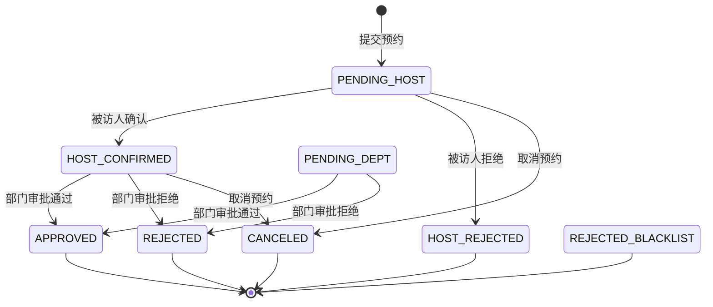
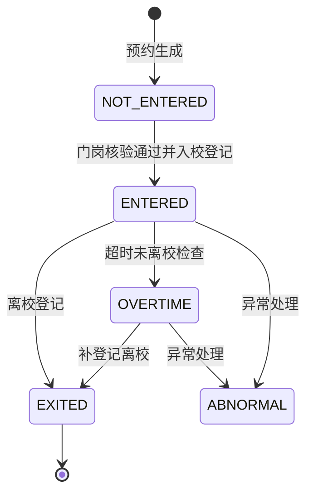

# 状态流转说明

## 1. 预约状态

| 状态编码 | 中文含义 | 进入条件 | 允许的后续动作 |
|---|---|---|---|
| `PENDING_HOST` | 待确认 | 访客提交预约且未命中黑名单 | 被访人确认、被访人拒绝、取消、修改 |
| `HOST_CONFIRMED` | 被访人已确认 | 被访人确认接待 | 部门审批通过、部门审批拒绝、取消、修改 |
| `PENDING_DEPT` | 待部门审批 | 历史测试数据或兼容状态 | 部门审批通过、部门审批拒绝、取消、修改 |
| `HOST_REJECTED` | 被访人已拒绝 | 被访人拒绝预约 | 终态，不能入校 |
| `APPROVED` | 审批通过 | 部门审批通过 | 查询通行凭证、门岗核验、入校登记 |
| `REJECTED` | 审批拒绝 | 部门审批拒绝 | 终态，不能入校 |
| `CANCELED` | 已取消 | 用户取消未审批结束预约 | 终态，不能入校 |
| `REJECTED_BLACKLIST` | 黑名单拦截 | 黑名单访客被系统拦截 | 终态，不能入校 |

## 2. 访问状态

| 状态编码 | 中文含义 | 进入条件 | 允许的后续动作 |
|---|---|---|---|
| `NOT_ENTERED` | 未入校 | 预约创建、取消、拒绝或审批通过但未入校 | 审批通过后可门岗核验和入校登记 |
| `ENTERED` | 已入校 | 门岗核验通过并完成入校登记 | 离校登记、超时检查 |
| `EXITED` | 已离校 | 门岗完成离校登记 | 终态，不能重复离校 |
| `OVERTIME` | 超时未离校 | 计划结束时间已过且未登记离校 | 离校登记、异常跟踪 |
| `ABNORMAL` | 异常处理 | 人工或系统标记异常 | 人工处理后归档 |

## 3. 非法流转控制

| 非法操作 | 系统处理 |
|---|---|
| 黑名单访客提交预约 | 返回错误：访客手机号或证件号命中有效黑名单，不能提交预约申请 |
| 未审批通过进行门岗核验 | 返回核验失败：预约未审批通过，不能入校 |
| 已拒绝或已取消预约生成通行码 | 返回错误：预约未审批通过，不能查询或生成通行凭证 |
| 通行码过期入校 | 返回核验失败：通行凭证不在有效期内 |
| 已入校后再次入校 | 返回核验失败：访客已入校或超时未离校，不能重复入校 |
| 已离校后再次离校 | 返回错误：该访客已登记离校，不能重复离校 |

## 4. 与数据库字段的对应关系

- 预约状态存储在 `visit_apply.apply_status`。
- 访问状态存储在 `visit_apply.access_status` 和 `access_record.access_status`。
- 审批历史存储在 `approval_record`，包括 `HOST_CONFIRM` 和 `DEPT_APPROVAL` 两个环节。
- 通行凭证存储在 `pass_code`，有效期由 `valid_from` 和 `valid_to` 控制。
- 出入校动作存储在 `access_record`，入校时间为 `entry_time`，离校时间为 `exit_time`。