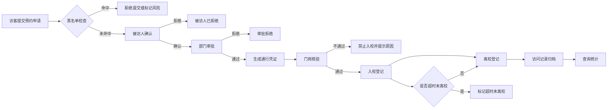

# 访客预约、审批、通行码与出入校核心流程说明

## 1. 流程目标

本流程服务于“重庆邮电大学智慧访客预约与出入校管理系统”的核心业务闭环，覆盖访客从预约申请到访问记录归档的全过程。系统通过黑名单检查、被访人确认、部门审批、通行凭证、门岗核验、入校登记、离校登记和超时未离校处理，保证校外访客入校流程可追溯、可控制、可统计。

## 2. 核心业务流程

## 3. 主要业务接口

| 业务动作 | 接口 | 角色 | 主要数据表 |
|---|---|---|---|
| 提交预约 | `POST /api/workflow/visit-applies` | 访客、系统管理员 | `visitor`, `visitor_vehicle`, `visitor_companion`, `visit_apply`, `blacklist`, `operation_log` |
| 查询我的预约 | `GET /api/workflow/visit-applies/my` | 访客、被访人、审批人员、管理员、校级管理人员 | `visit_apply`, `visitor` |
| 修改未审批预约 | `PUT /api/workflow/visit-applies/{id}` | 访客、系统管理员 | `visit_apply`, `visitor_vehicle`, `visitor_companion`, `operation_log` |
| 取消未审批预约 | `POST /api/workflow/visit-applies/{id}/cancel` | 访客、系统管理员 | `visit_apply`, `operation_log` |
| 被访人确认/拒绝 | `POST /api/workflow/host/{id}/confirm`、`/reject` | 被访人、系统管理员 | `visit_apply`, `approval_record`, `operation_log` |
| 部门审批通过/拒绝 | `POST /api/workflow/department/{id}/approve`、`/reject` | 部门审批人员、系统管理员 | `visit_apply`, `approval_record`, `pass_code`, `operation_log` |
| 查询通行凭证 | `GET /api/workflow/pass-codes` | 访客、门岗安保、管理员、校级管理人员 | `pass_code`, `visit_apply` |
| 门岗核验 | `POST /api/workflow/gate/verify` | 门岗安保、系统管理员 | `visit_apply`, `visitor`, `pass_code`, `blacklist`, `access_record` |
| 入校登记 | `POST /api/workflow/access/entry` | 门岗安保、系统管理员 | `access_record`, `visit_apply`, `pass_code`, `operation_log` |
| 离校登记 | `POST /api/workflow/access/exit` | 门岗安保、系统管理员 | `access_record`, `visit_apply`, `operation_log` |
| 超时未离校查询/标记 | `GET /api/workflow/access/overtime?mark=true` | 门岗安保、系统管理员、校级管理人员 | `access_record`, `visit_apply`, `operation_log` |

## 4. 关键业务规则

1. 提交预约时必须校验手机号和证件号是否命中有效黑名单，命中后拒绝提交。
2. 预约必须先由被访人确认，再由部门审批人员审批。
3. 只有审批通过的预约才能生成通行凭证。
4. 已取消、被访人已拒绝、审批拒绝、黑名单拦截的预约不能生成通行凭证。
5. 门岗核验必须同时检查预约状态、访问时间、通行凭证有效期、黑名单和是否重复入校。
6. 未审批通过不能入校，已拒绝不能入校，已离校不能重复离校。
7. 每次确认、审批、入校、离校和超时标记都写入 `operation_log`，审批动作同时写入 `approval_record`。
8. 预约结束时间已过且尚未离校的访问记录，可被标记为超时未离校。

## 5. 数据归档说明

系统不在离校后删除预约或出入校记录，而是通过 `visit_apply.access_status = EXITED` 和 `access_record.exit_time` 表示访问完成。后续统计报表可按部门、校门、访问时间、审批结果和通行状态进行聚合分析。